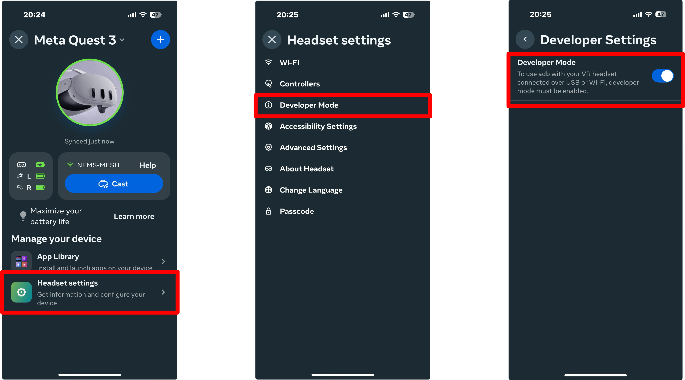
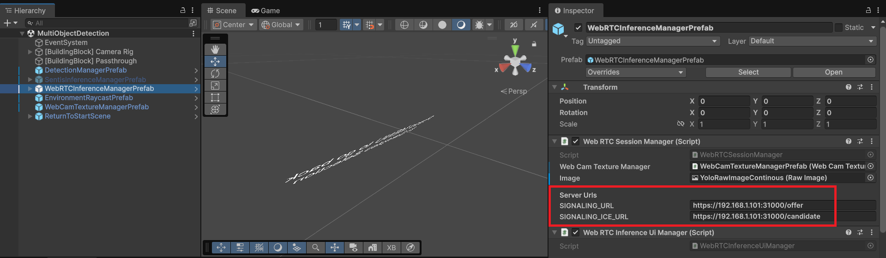
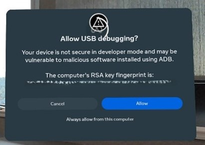

# Mosaic-XR-Unity

## Environment

Equipment: Meta Quest 3 (OS Version: v81.0)

Unity Version: 6000.0.53f1

## Prerequisites

### 眼鏡端

請確保透過 Meta Horizon 在 Meta Quest 上啟用 USB 偵錯（ADB）

裝置上需開啟開發人員設定（進階 -> 啟用開發人員設定）

首次進入時，若跳出是否允許此 app 存取權限（如：頭戴式裝置相機）請選是，或至設定 -> app 權限內改為允許。

## Instructions

安裝 Unity Hub 及對應之 Unity 版本（6000.0.53f1）

開啟後按照伺服器環境修改連線目標 IP 及 Port

修改完畢即可編譯至眼鏡端執行，進入後按下 **A 鍵**即可開始使用。

> 若電腦先前未透過 ADB 連接至該眼鏡，請**務必**切換至**綁定眼鏡之個人檔案**進行編譯執行，當跳出是否允許 USB 偵錯視窗時，選擇一律允許。

